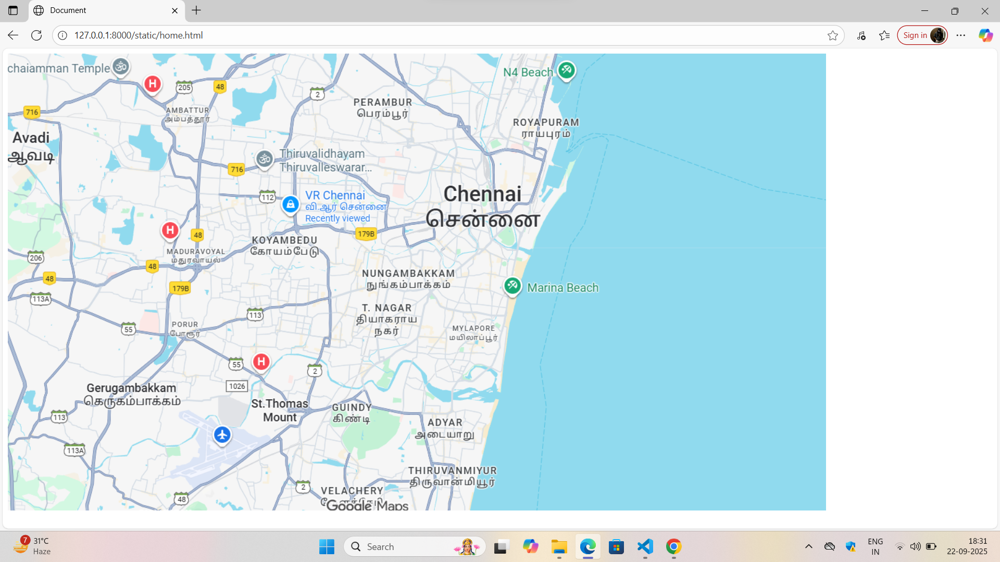
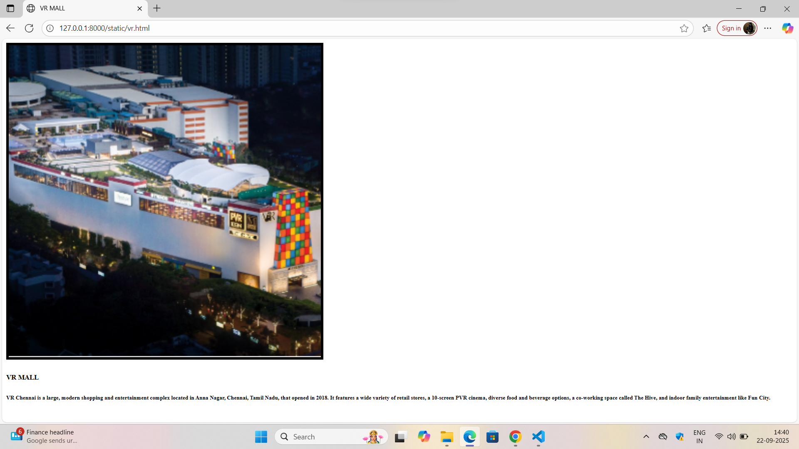

# Ex04 Places Around Me
## Date: 22.09.2025

## AIM
To develop a website to display details about the places around my house.

## DESIGN STEPS

### STEP 1
Create a Django admin interface.

### STEP 2
Download your city map from Google.

### STEP 3
Using ```<map>``` tag name the map.

### STEP 4
Create clickable regions in the image using ```<area>``` tag.

### STEP 5
Write HTML programs for all the regions identified.

### STEP 6
Execute the programs and publish them.

## CODE
~~~
home.html
<!DOCTYPE html>
<html lang="en">
<head>
    <meta charset="UTF-8">
    <meta name="viewport" content="width=device-width, initial-scale=1.0">
    <title>Document</title>
</head>
<body>
   <!-- Image Map Generated by http://www.image-map.net/ -->


<map name="image-map">
    <area target="" alt="VR MALL" title="VR MALL" href="vr.html" coords="403,188,594,317" shape="rect">
    <area target="" alt="St.Thomas mount" title="St.Thomas mount" href="mount.html" coords="349,484,541,515,321,663" shape="poly">
    <area target="" alt="Marina beach" title="Marina beach" href="marina.html" coords="759,356,82" shape="circle">
</map>
</body>
</html>

vr.html
<!DOCTYPE html>
<html lang="en">
<head>
    <meta charset="UTF-8">
    <meta name="viewport" content="width=device-width, initial-scale=1.0">
    <title>VR MALL</title>
</head>
<body>
    
    <h5>VR MALL</h5>
    <h6>VR Chennai is a large, modern shopping and entertainment complex located in Anna Nagar, Chennai, Tamil Nadu, that opened in 2018. It features a wide variety of retail stores, a 10-screen PVR cinema, diverse food and beverage options, a co-working space called The Hive, and indoor family entertainment like Fun City.</h6>
</body>
</html>

mount.html
<!DOCTYPE html>
<html lang="en">
<head>
    <meta charset="UTF-8">
    <meta name="viewport" content="width=device-width, initial-scale=1.0">
    <title>ST.THOMAS MOUNT</title>
</head>
<body>
     
    <h5>ST.THOMAS MOUNT</h5>
    <h6>St. Thomas refers to Thomas the Apostle, one of Jesus Christ's twelve apostles, who is believed to have traveled to India to spread Christianity in the 1st century AD</h6>
</body>
</html>

marina.html

<!DOCTYPE html>
<html lang="en">
<head>
    <meta charset="UTF-8">
    <meta name="viewport" content="width=device-width, initial-scale=1.0">
    <title>MARINA BEACH</title>
</head>
<body>
     
    <h5>MARINA BEACH</h5>
    <h6>Marina Beach is India's longest and the world's second-longest natural urban beach, located in Chennai along the Bay of Bengal. Stretching approximately 13 kilometers, it's a major city landmark and a popular spot for recreation, offering views of the sea and featuring statues of historical figures.</h6>
</body>
</html>
~~~

## OUTPUT





## RESULT
The program for implementing image maps using HTML is executed successfully.
